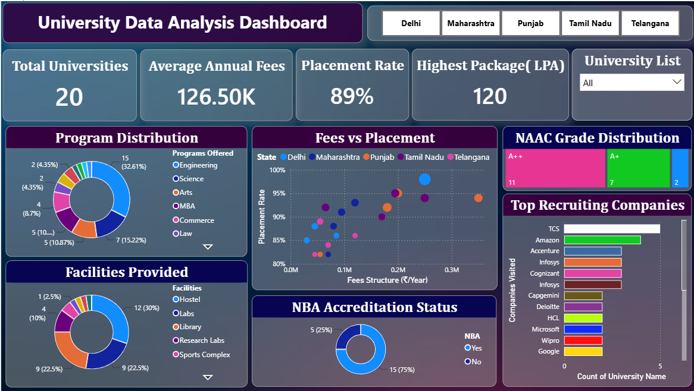

# 🎓 University Analytics Dashboard | Power BI

An interactive Power BI dashboard built to compare universities across different Indian states using key academic and placement metrics. This dashboard provides meaningful insights into university rankings, accreditation, fees, placement performance, and facilities through interactive visualizations.

---

## 📷 Dashboard Preview

> Upload your dashboard screenshot as **Dashboard.png** and replace the placeholder below.

```html
<p align="center">
  
</p>
```

---

## 📌 Project Overview

This dashboard helps users compare universities based on multiple performance indicators, making it easier to analyze academic quality and placement opportunities.

---

## 📊 Dashboard Features

* State-wise university analysis
* NIRF Ranking comparison
* IIRF Ranking analysis
* NAAC Accreditation overview
* NBA Accreditation status
* Placement Rate analysis
* Highest & Lowest Package comparison
* Fee Structure comparison
* Programs Offered analysis
* Facilities available across universities
* Companies Visiting Campus
* Interactive slicers and filters
* KPI cards for quick insights

---

## 📈 Key Metrics

* Number of Universities
* Average Placement Rate
* Average Fees
* Highest Package
* Lowest Package
* Average NIRF Ranking
* Average IIRF Ranking

---

## 🛠️ Skills Demonstrated

* Power BI
* Power Query
* Data Cleaning
* Data Transformation
* Data Modeling
* Dashboard Design
* Interactive Visualizations
* KPI Cards
* Bar Charts
* Column Charts
* Pie & Donut Charts
* Matrix/Table Visual
* Slicers & Filters
* Business Intelligence

---

## 💡 Business Insights

* Compare universities across different states.
* Identify institutions with higher placement rates.
* Analyze fee structures against placement outcomes.
* Compare accreditation status (NAAC & NBA).
* Identify universities offering the highest salary packages.
* Compare ranking trends using NIRF and IIRF.

---

## 🧰 Tools Used

* Power BI Desktop
* Microsoft Excel
* Power Query

---

## 📁 Files Included

```
University Analytics Dashboard.pbix
University Dataset.xlsx
Dashboard.png
README.md
```

---

## 🚀 Future Improvements

* Add drill-through pages
* Add map visualization
* Include scholarship analysis
* Add year-wise comparison
* Add dynamic tooltips

---

## 👩‍💻 Author

**Dilpreet Kaur**

Aspiring Data Analyst | Power BI | SQL | Python | Excel
